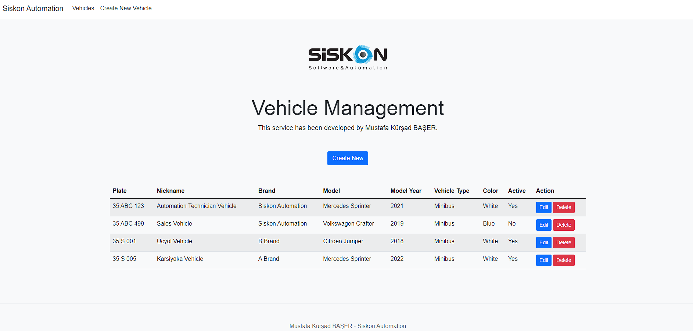
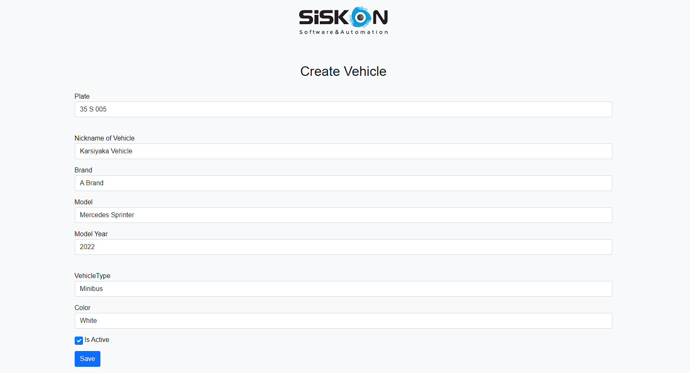
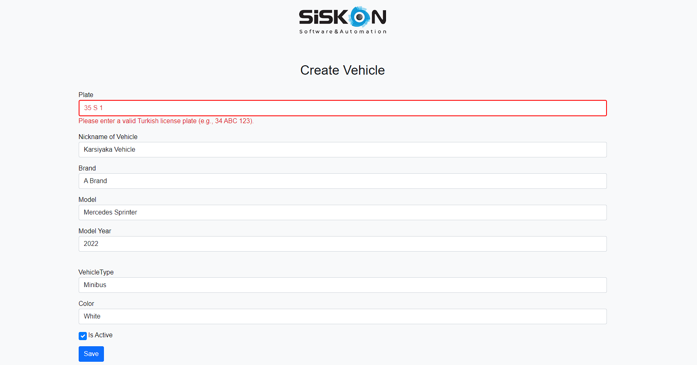
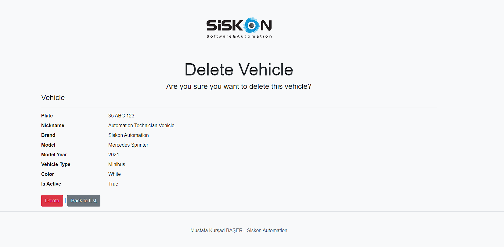

# Vehicle App - Siskon Automation

This project is a vehicle management system built using ASP.NET Core MVC. The application allows users to create, view, and manage vehicle records.

## Technologies Used

- **ASP.NET Core MVC**: Web application framework used to build the project.
- **Entity Framework Core**: ORM used for data access.
- **Bootstrap 4**: CSS framework for responsive design.
- **jQuery**: JavaScript library for DOM manipulation and AJAX calls.

## Features

- Create, view, update, and delete vehicle records.
- Form validation for Turkish license plate format/standard.
- Modern and responsive UI using Bootstrap.

## Prerequisites

- [.NET SDK](https://dotnet.microsoft.com/download) 5.0 or later
- [Visual Studio](https://visualstudio.microsoft.com/) 2019 or later
- [SQL Server](https://www.microsoft.com/en-us/sql-server/sql-server-downloads) (LocalDB or any other edition)

## Screenshots









## Getting Started

Follow these steps to get the project up and running on your local machine.

### Clone the Repository

```bash
git clone https://github.com/mustafakbaser/VehicleApp-Siskon.git
cd vehicleapp-siskon
```

### Set Up the Database
1. Open appsettings.json and update the connection string to point to your SQL Server instance.

```bash
"ConnectionStrings": {
  "DefaultConnection": "Server=YOUR_SERVERNAME_;Database=YOUR_DATABASENAME_;Trusted_Connection=True;"
}
```

2. Open the Package Manager Console in Visual Studio and run the following commands to apply migrations and create the database:

```bash
Update-Database
```

### Build and Run the Project
1. Open the solution in Visual Studio.
2. Build the project to restore all dependencies.
3. Run the project by pressing F5 or using the run button.

The application should start, and you can navigate to https://localhost:5001/Vehicles/Index to view the vehicle management interface.

### Project Structure
- Controllers: Contains MVC controllers.
- Models: Contains the data models and Entity Framework configurations.
- Views: Contains views for the MVC application.
- wwwroot: Contains static files such as CSS, JavaScript, and images.

## Database Query

```bash
CREATE DATABASE YOUR_DATABASENAME;
GO

USE YOUR_DATABASENAME;
GO

CREATE TABLE Vehicles (
    Plate VARCHAR(10) PRIMARY KEY,
    Nickname VARCHAR(50),
    Brand VARCHAR(50),
    Model VARCHAR(50),
    ModelYear INT,
    VehicleType VARCHAR(20),
    Color VARCHAR(20),
    IsActive BIT
);
GO
```